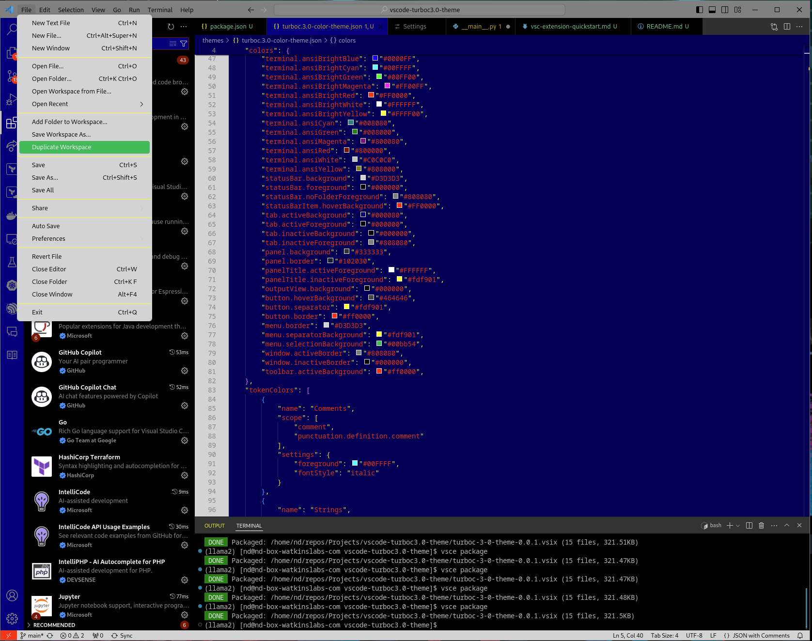
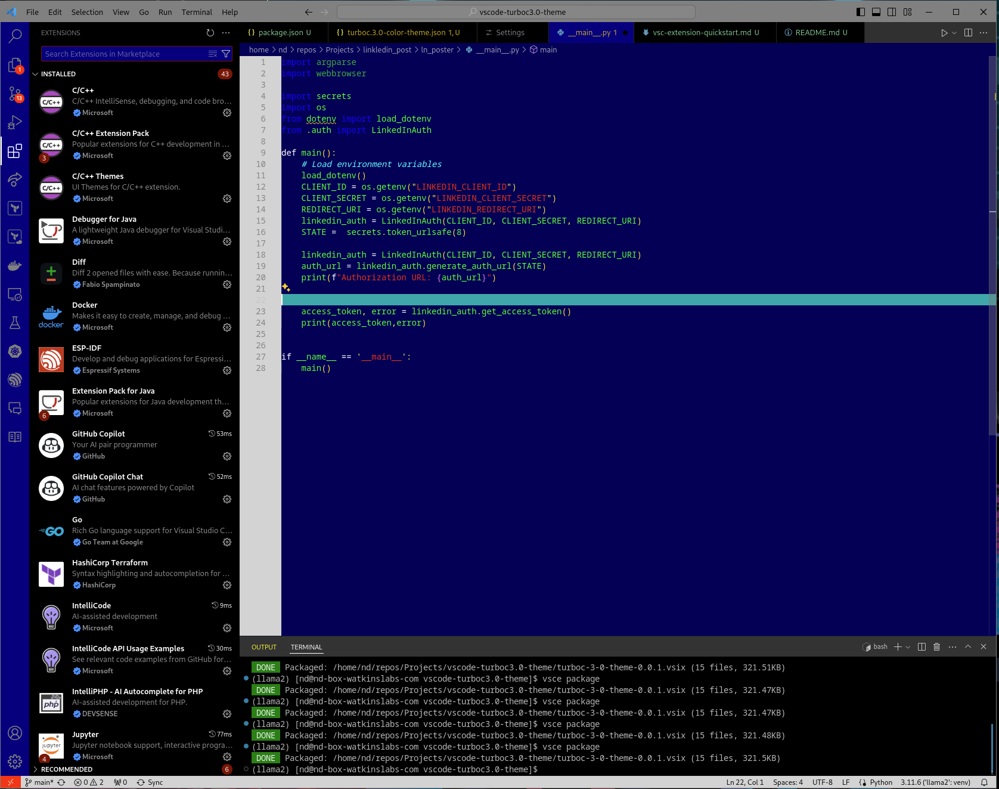

# Turbo C 3.0 Theme for VSCode

Bring the classic look of Turbo C 3.0 from 1991 into your Visual Studio Code environment with the Watkins Labs Turbo C 3.0 Theme. This theme reproduces the distinctive blue background and high-contrast text colors that were iconic to early software development environments.

## Features

- **Authentic Color Scheme:** Experience the nostalgia with the original Turbo C blue background and yellow text.
- **Easy on the Eyes:** Designed to be easy on the eyes for long coding sessions.
- **Wide Language Support:** Whether you're writing C, C++, Java, or any other major language, enjoy syntax highlighting that keeps the spirit of Turbo C.

## Installation

To install the Turbo C 3.0 Theme:

1. Download the `.vsix` file from the Releases section.
2. Open Visual Studio Code.
3. Go to the Extensions view by clicking on the square icon on the sidebar or pressing `Ctrl+Shift+X`.
4. Click on the "..." at the top-right of the Extensions view, select "Install from VSIX...", and choose the downloaded file.
5. Activate the theme by going to `View -> Command Palette`, typing "Color Theme", and selecting "Watkins Labs Turbo C 3.0 Theme".
6. For the main title bar to be themed you need to allow it int preferences -> Window: Title Bar Style

## Contributing

If you'd like to contribute to the development of this theme, please fork the repository and submit a pull request. You can also submit issues if you find bugs or have suggestions for improvements.

## License

This theme is released under the BSD 3 Revised License. For more details, see the [LICENSE](LICENSE) file in the repository.

## Author

Turbo C 3.0 Theme was created by [Charles Watkins](https://watkinslabs.com). For more information, feel free to contact me.

## Acknowledgements

Thanks to all the contributors who have helped shape this theme, and to the vibrant VSCode community for their continuous support and feedback.

## The font used Perfoect Dos VGA 437.ttf was created by:
- Zeh Fernando
- zeh@zehfernando.com
-  www.zehfernando.com

## Screenshots

Include screenshots to help users see what the theme looks like in action!

---

We hope you enjoy coding with this classic theme as much as we enjoyed making it!
